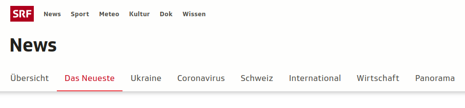

# Tutorial: Automated Webscraping with AWS

 

## Learn how to scrape information such as news headlines daily with an automated script.

**Wonder what's in the news today?**
 
 

## Project Intro/Objective
The purpose of this project is to showcase an automated webscraping example and to document all the steps in the set-up. This should enable others to learn about automation with AWS and to replicate this process to solve their own tasks.

### Methods Used
* Webscraping
* Virtual Machines

### Technologies
* Python: Pandas, BeautifulSoup, requests
* Jupyter Notebook (for exploration)
* PyCharm (for production)
* AWS (S3 for storage, EC2 for cloud computing)

## Project Description
I'm interested in trying out NLP tasks such as Named Entity Recognition, Topic Modelling or Sentiment Analysis on German language data, since it is my native language and most of the well-documented use cases focus on English. I thought a good source for the text data would be the Swiss national TV and Radio broadcaster SRF. The articles on their main [news website](https://www.srf.ch/news/das-neueste) are updated frequently, cover a wide range of topics and there are very few spelling or grammar errors (which cannot be taken for granted especially with online resources). So I decided to scrape their website daily to put together a good German language dataset. The webscraping script can be found [here](https://github.com/Alessine/aws_webscraping_automation/blob/master/src/main.py).

As mentioned, when I started this project, I wanted to learn how to automate a webscraping task, so that I would be able to build my own dataset. However, when I started looking into resources on webscraping automation, I did not find anything that really matched my needs and interests. Therefore, I decided to invest a bit more into the documentation of this project and write up an article on Medium, so that others can use my learnings to work on their own automation projects.

## Featured Materials
* [Blog Post](link)
* [Notebook 1: Developing a Webscraping Script for Automation on AWS](https://github.com/Alessine/aws_webscraping_automation/blob/master/notebooks/220601_nb1_aws_webscraping_automation.ipynb)
* [Project Requirements](https://github.com/Alessine/aws_webscraping_automation/blob/master/requirements.txt)

## Questions?

If you have any questions you can get in touch with me via LinkedIn: **[Angela Niederberger](https://www.linkedin.com/in/angela-niederberger/)**
