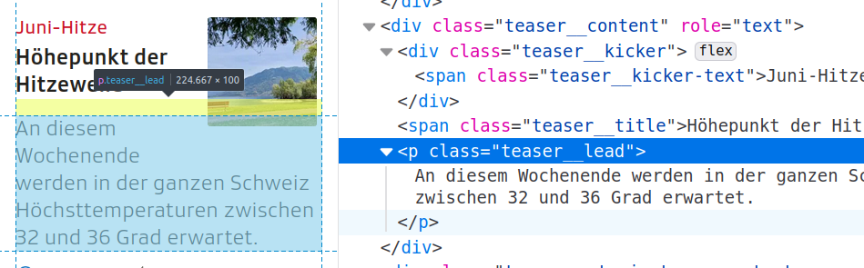

# Tutorial: Automated Web-scraping with AWS

 

## Learn how to move your scraping job into the cloud.

**Want to collect all kinds of data without even thinking about it?**
 
 

## Project Intro/Objective
The purpose of this project is to showcase an automated web-scraping example and to document all the steps in the set-up. This should enable others to learn about automation with AWS and to replicate this process to solve their own tasks.

### Methods Used
* Web-scraping
* Virtual Machines

### Technologies
* Python: Pandas, BeautifulSoup, requests
* Jupyter Notebook (for exploration)
* PyCharm (for production)
* AWS (S3 for storage, EC2 for cloud computing)

## Project Description
I'm interested in trying out NLP tasks such as Named Entity Recognition, Topic Modelling or Sentiment Analysis on German language data, since it is my native language and most of the well-documented use cases focus on English. I thought a good source for the text data would be the Swiss national TV and Radio broadcaster SRF. The articles on their main [news website](https://www.srf.ch/news/das-neueste) are updated frequently, cover a wide range of topics and there are very few spelling or grammar errors. So I decided to scrape their website daily to put together a unique and interesting German language data set. The web-scraping script can be found [here](https://github.com/Alessine/aws_webscraping_automation/blob/master/src/main.py).

As mentioned, when I started this project, I wanted to learn how to automate a web-scraping task, so that I would be able to build my own data set. However, when I started looking into resources on web-scraping automation, I did not find anything that really matched my needs and interests. Therefore, I decided to invest a bit more into the documentation of this project and write up an article, so that others can use my learnings to work on their own automation projects.

## Folder Structure
Here's is how I organized this project:

├── data  
│ ├── processed  
│ └── raw  
│  &nbsp; &nbsp;  └── 2022-06-01_srf_news_snippets.csv &nbsp; &nbsp; &nbsp; &nbsp; *<-- example data file*  
│  
├── notebooks  
│ ├── 220601_nb1_aws_webscraping_automation.ipynb   &nbsp; &nbsp; &nbsp; &nbsp; *<-- developing the webscraping script*  
│ └── 220605_nb2_srf_headlines_analysis.ipynb   &nbsp; &nbsp; &nbsp; &nbsp; *<-- first peak at the new dataset*  
│  
├── references  
│  
├── reports   
│ └── img   
│  
├── src  
│  ├── main.py     &nbsp; &nbsp; &nbsp; &nbsp; *<-- scraping script to run in the cloud*  
│  └── main_local.py     &nbsp; &nbsp; &nbsp; &nbsp; *<-- scraping script to run locally*  
│  
├── .gitignore  
├── LICENSE  
├── README.md  
└── requirements.txt       &nbsp; &nbsp; &nbsp; &nbsp; *<-- list of all the requirements for this project*  

## Featured Materials
* [Notebook 1: Developing a Web-scraping Script for Automation on AWS](https://github.com/Alessine/aws_webscraping_automation/blob/master/notebooks/220601_nb1_aws_webscraping_automation.ipynb)
* [Example Data File](https://github.com/Alessine/aws_webscraping_automation/blob/master/data/raw/2022-06-01_srf_news_snippets.csv)
* [Project Requirements](https://github.com/Alessine/aws_webscraping_automation/blob/master/requirements.txt)
* Blog Post: Will be published soon

## Questions?
If you have any questions you can get in touch with me via [LinkedIn](https://www.linkedin.com/in/angela-niederberger/).
